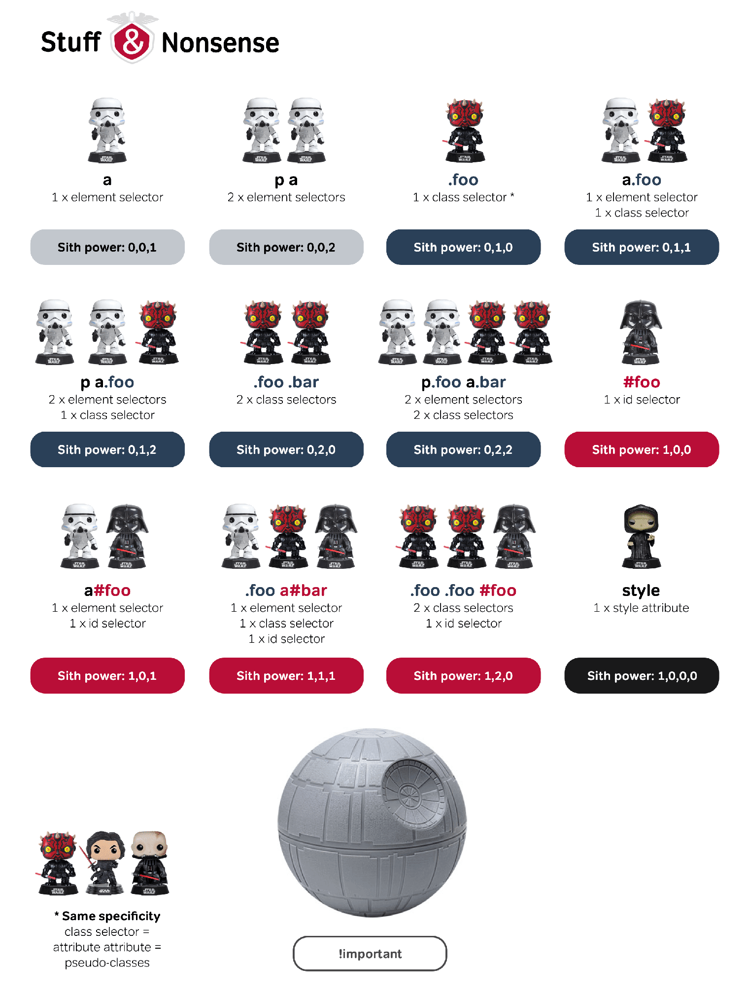

## CSS 預處理器是什麼？我們可以不用它嗎？
一套語法將 css 寫法程式化，更加方便與簡潔，經預處理器編譯後即為一般 css，常見預處理器為 Scss/Sass、Less、Stylus。  
不使用的預處理器也能直接編寫原生 css。

## 請舉出任何一個跟 HTTP Cache 有關的 Header 並說明其作用。

Expires，設定確切到期的期限，但是看使用端日期而判斷
```php
<?php
header('Expires: Wed, 21 Aug 2018 11:00:00 GMT');
// 日期格式，"ddd, dd MMM yyyy HH:mm:ss GMT"
?>
```

Cache-Control header 與 max-age 設定 cache 的存活期限，會 overwrite Expires 
```php
<?php
header('Cache-Control: max-age=15'); // max-age 單位為秒(s)
echo time();
?>
```

## Stack 跟 Queue 的差別是什麼？
* Stack
  First In, Last Out
  想像一個容器只有上方開口，只能從上方放東西進去，也只能從上方取出最上層的東西

```
stack.push(1)     // [1]
stack.push(30)    // [1, 30]
stack.push(9)     // [1, 30, 9]
stack.pop()       // [1, 30]
stack.pop()       // [1]
```

* Queue
  First In,First Out
  想像為一個排隊隊伍，先進先出

```
queue.push(1)   // [1]
queue.push(30)  // [1, 30]
queue.push(9)   // [1, 30, 9]
queue.shift()   // [30, 9]
queue.shift()   // [9]
```

## 請去查詢資料並解釋 CSS Selector 的權重是如何計算的（不要複製貼上，請自己思考過一遍再自己寫出來）

引入 css 方法有三種，分別為行內、頁面、鏈結，而引入 css 離 DOM 越近權重越高，所以行內樣式權重最高，其次為頁面，最後為鏈結。

```html
<link href="style.css" rel="stylesheet" type="text/css"/>
<style>
  p {
    color: red;
  }
</style>
<body>
<p style="color: black">test</p>
</body>
```
test 為黑色

</br>

後面定義的 css 會覆蓋出前面

```css
p {
  color: red;
}
p {
  color: blue;
}
```
`<p>` 內容文字為藍色

</br>

當選擇器指定的越精確時，權重也越高  
id 高於 class，因 id 具唯一性，而 class 可能很多個  
對`<div>`後代`<p>`的選擇器比只有`<p>`的選擇器精確  
```css
div p {color: yellow}
div.red p{color:red}
div p#black{color:black}
p{color:blue}
```
```html
<div>
  <p>黃色，雖然我是 p</p>
  <div class='red'>
    <p>紅色，雖然我是 p 也是 div 裡的 p</p>
    <p id='black'>黑色，雖然我是 class='red' 的 div 的後代也是 p 也是 div 裡的 p</p>
  </div>
</div>
<p>藍色</p>
```

</br>

便有了以下計算規則  
|style inline </br>attribute|ID|Class,</br>psuedo-class,</br>attribute|Elements|
|-|-|-|-|
|0|0|0|0|
```css
a{color:red}; /* 0,0,0,1 */
div a{color:yellow}; /* 0,0,0,2 */
.link a{color:black}; /* 0,0,1,1 */
#green a{color:green}; /* 0,1,0,1 */
div #green a{color:pink}; /* 0,1,0,2 */
```
* 由左至右比較，前一等級相等才往後比
* 權重相同時，後面的會覆蓋前面的
* !importment 無視其他規則，為最高權重


網路上找到的權重圖，覺得挺可愛的w


## 挑戰題：去查詢什麼是 PostCSS 並使用它，順便解釋為什麼我們需要 PostCSS。
預處理器有各自的語法規定，如果要更換語法便要再次學習，不得不捨棄些什麼，然而後處理器則是建立於原生 css 上，可以隨自己需求增減功能插件。

[postcss](https://postcss.org/)
在官網中可以看到他的幾個特色
* 增加可讀性
* 使用最新的 CSS 寫法
* 檢測語法錯誤
* 模組化 CSS
* 網格系統

[筆記後半，postcss autoprefixer 簡易使用流程](https://github.com/Ponchimeow/note/blob/master/study/CSS/processor.md)

