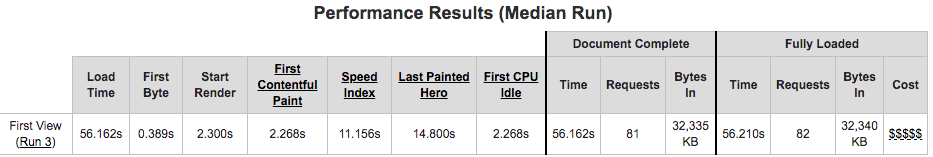
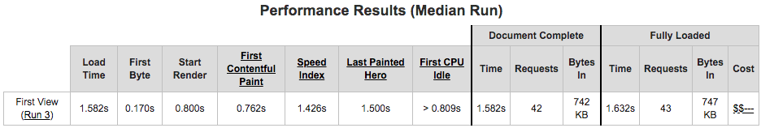

## 十六到二十週心得

### Week16
SASS、SCSS 以前有聽過，以為是 css 的變體是不一樣的東西(?)，在使用上搭配 `gulp-watch` 來做重新執行轉譯，不過還沒真的實際使用過

### Week17
一步一步的瞭解到 js 如何運作，解說配影片其實算蠻好理解的，不懂就多聽幾次就是(?)

### Week18
初試 gulp 與 webpack，只知道大概作用與流程，要做到完整的自動化還有很大段距離，不過能感受到將多個事項整合起來的方便性

### Week19
改寫 todolist，寫成 api 形式，在想試著使用 api blueparint 上花了點時間，改寫 api 也花了點時間，有時候也會覺得一段時間沒寫 code，就有點小陌生了(扶額)

### Week20
主要在網頁優化，看一些之前沒看完的文章，聽 DevMurMur Kenji Chao 美國工作的分享

優化後  
[lazy-hackathon](https://ponchimeow.github.io/lazy-hackathon/build/index.html)

fork 專案後於 Settings -> GitHub Pages -> Source -> Master branch -> 產生 url 完成 github page 部署
  
完全未更動下，使用 [webpagetest](https://www.webpagetest.org/) 測試為如下，由網頁下方統計圖表可以大概知道是圖片與文字的問題

  
1. index.html 刪除介紹、出師表、長恨歌註解，刪除未使用的 js 載入  
2. js 乍看下有些沒用到的 functoin，測試後刪除  
3. 將套件改為 cloudflare cdn，去除沒用到的 cdn
4. 將 icon 分類組合為 CSS Sprite，使用 [sprite-generator](https://www.toptal.com/developers/css/sprite-generator)
5. 使用 [imageoptim](https://imageoptim.com/) 去除中繼資料
6. 使用 gulp 套件如下
   + [gulp-plumber](https://www.npmjs.com/package/gulp-plumber)，catch exception 
   + [gulp-rename](https://www.npmjs.com/package/gulp-rename)，重新命名
   + [gulp-htmlmin](https://www.npmjs.com/package/gulp-htmlmin)，壓縮 html
   + [gulp-responsive](https://www.npmjs.com/package/gulp-responsive)，修改圖片大小與品質
   + [gulp-imagemin](https://www.npmjs.com/package/gulp-imagemin)，壓縮圖片
   + [gulp-webp](https://www.npmjs.com/package/gulp-webp)，轉換圖片格式為 webp
   + [gulp-concat](https://www.npmjs.com/package/gulp-concat)，合併 css、js
   + [gulp-clean-css](https://www.npmjs.com/package/gulp-clean-css)，壓縮 css 
   + [gulp-uglify-es](https://www.npmjs.com/package/gulp-uglify-es)，壓縮 js
7. 最後的測試如下，錢錢從五個變兩個，[PageSpeed Insights](https://developers.google.com/speed/pagespeed/insights/) 測試則是從行動版 23 分與電腦版 68 分，提升至行動版 89 分與電腦版 99 分
   

Ｗeek21 終於要進到框架，希望在學習上還行，只是單純覺得是必要的技能，雖然每個都很重要就是w

