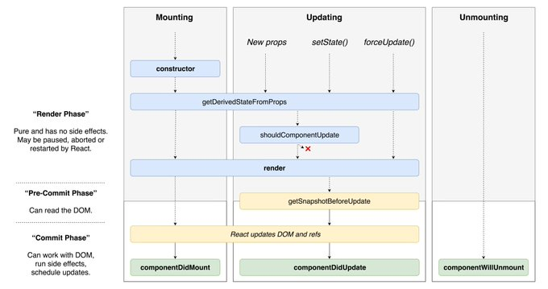

## 為什麼我們需要 React？可以不用嗎？
沒有什麼工具是一定必要的，視需求而定。
* 為何使用 React
  * 將各個畫面以 component 拆解組成，使得前端更容易封裝與模組化重複使用
  * 以 virtual DOM 比較狀態間的差異，對真正需要更動的 DOM 進行操作
  * 在同一個檔案中就能看見`資料`與其`排版`

## React 的思考模式跟以前的思考模式有什麼不一樣？
以資料狀態`state`做思考，當`state`變更時才 render DOM，且 react 能在同個檔案就看到資料的編排，以往須來回切換

## state 跟 props 的差別在哪裡？
* state
  當前 component 的狀態，可直接改變自己的state，而 state 改變時，便 re-render 當前 component
* props
  父層 component 傳入的狀態，無法直接改變值，需要從父層傳入方法才能

## 請列出 React 的 lifecycle 以及其代表的意義
  
(Image by [Dan Abramov](https://twitter.com/dan_abramov/status/1019527421303951360?s=20))

Mounting：已插入真實的 DOM
Updating：正在被重新渲染
Unmounting：已移出真實的 DOM

16.3版後，不推薦使用`componentWillMount`、`componentWillReceiveProps`、`componentWillUpdate`，會被加上`UNSAFE_`前綴，17版後會被拋棄

### Mounting

取得元件初始參數與狀態，建立元件。 

#### constuctor
當 React component 為 class component，則建立時便會執行`constuctor`方法初始化，所以 functional component 沒有`constructor`，若有需要使用到父層則須注意要將 `porps` 代入，使用 `super(props)`繼承父類別

#### getDerivedStateFromProps(nextProps, prevState)
`nextProps`為更新後的 porps ，`prevState`為先前的 state ，這個方法會在初始 render 前調用，父層元件 re-render 時也會調用。

`getDerivedStateFromProps`更新 state 必須回傳物件，如不更新則回傳 null。

#### render()
更新 State、父元件傳遞的 props 皆會執行`render()`，回傳為 JSX，若不回傳內容則回傳 bollean、null。

#### componentDidMount
在`render`建立 component 後調用，若在這使用`setState`則會造成`render`執行兩次。

若在這進行 DOM eventListener 綁定，則需要在 willUnMount 記得取消 eventListener 綁定，避免`render`元件重新執行`componentDidMount`造成事件重複綁定。

### Updating

當元件中`state`或`props`改變時，component 就會 update。

以下五種內建方法為 React update 時會呼叫的:
getDerivedStateFromProps()
shouldComponentUpdate()
render()
getSnapshotBeforeUpdate()
componentDidUpdate()

其中`render()`為每次 update 都會呼叫，其餘則視狀況需求而定

#### getDerivedStateFromProps(nextProps, prevState)
依據新傳入的 props 的改變來更新 state，由於`getDerivedStateFromProps`為靜態(static)，所以也不能直接調用`this`

#### shouldComponentUpdate(nextProps, nextState)
回傳 boolean，預設為 true，用來確認是否 re-render
一般用來阻止不必要的 render 以節省效能

#### render()
與 Mounting 相同

#### getSnapshotBeforeUpdate(prevProps, prevState)
為 `render()`前最後一個方法，可以在這檢查`state`與`props`的狀態，並給`componentDidUpdate`作為參數用

#### componentDidUpdate(prevProps, prevState, snapshot)
於 Updating 階段中最後執行，畫面渲染後調用

### Unmounting
當 component 從 DOM 中移除前執行

#### componentWillUnmount
元件移除前也一併移除一些元件內的雜物，清除綁定 evet linstener，清除 cookie、local storage等，

### Error
#### getDerivedStateFromError
在發生錯誤時，更新 state

#### componentDidCatch(error, info)
error: 錯誤訊息
info: stack trace

在 Lifecycle method 中的 error 才會觸發`componentdidCatch`

### Reference
[React 16.3 之後的Lifecycle hooks](https://medium.com/@nightspirit622/react-16-3-%E4%B9%8B%E5%BE%8C%E7%9A%84lifecycle-hooks-311661f65859)  
[React Life Cycle 生命週期更新版，父子元件執行順序, Ian Chu
](https://iandays.com/2018/07/27/reactlife/)  
[React 16：Lifecycle Methods 新手包](https://5xruby.tw/posts/react-16-lifecycle-methods/)  
[w3c,React Lifecycle](https://www.w3schools.com/react/react_lifecycle.asp)